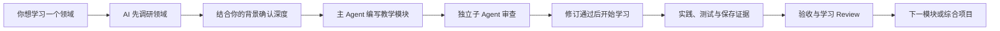

# Study Anything

> 把任意领域，变成一套 AI 真正能够长期带你学下去的学习系统。

[](LICENSE)


Study Anything 是一个面向通用 AI Agent 的开源学习工作台 Skill。它不只是帮你列课程、做计划或整理笔记，而是把“领域调研、目标确认、教学内容、独立审查、动手实践、能力验收、进度留痕和跨 Agent 接手”组织成一条完整链路。

你只需要告诉 Agent 想学什么，剩下的工作由一套可追溯的机制接住。

```text
不是“给我一份学习路线”
而是“建立一个能持续运行、能检查质量、能证明结果的学习项目”
```

## 为什么需要 Study Anything？

很多人用 AI 学习时都会遇到类似问题：

- 一开始连领域包含什么都不知道，却先被要求决定“学到什么程度”；
- AI 很快生成几十条学习计划，但第二天就不知道该从哪里继续；
- 教学内容看起来完整，却没人检查知识错误、难度跳跃和不可运行的代码；
- 看了很多课程、记了很多笔记，却没有证据说明自己真正掌握；
- 换一个 Agent 或开启新对话后，前面的学习状态几乎全部丢失；
- 学习资料、代码、实验结果和复盘分散在不同位置，无法形成长期资产。

Study Anything 的目标，就是把这些断点连起来。

它让 AI 不再只是一次性回答问题的助手，而是成为一套可以调研、备课、审课、教学、验收和交接的学习协作系统。

## 一句话理解



## 它和普通学习计划有什么不同？

| 普通 AI 学习对话 | Study Anything |
| --- | --- |
| 用户先决定学什么 | AI 先调研，再帮用户做有信息基础的选择 |
| 一次生成大量课程目录 | 根据当前状态按需创建下一个模块 |
| 同一个 Agent 自己写、自己检查 | 主 Agent 编写，独立子 Agent 审查 |
| 看完或运行成功就算完成 | 必须满足验收标准并留下实践证据 |
| 进度留在聊天记录里 | 进度、证据和 Review 持久化到文件 |
| 新会话需要重新解释背景 | 新 Agent 按使用文档和进度表直接接手 |
| 内容、代码和结果混在一起 | 教学、实践、测试、证据和审查各归其位 |

## 核心能力

### 1. 调研先行：你不需要一开始就懂这个领域

当用户只知道“我想学 AI”“我想学嵌入式”“我想系统学产品设计”时，Study Anything 不会立刻生成一份看似完整的课程表。

它会先调查：

- 这个领域解决什么问题；
- 核心知识和前置依赖是什么；
- 常见工具、实践和应用场景有哪些；
- 入门、独立实践和项目交付分别意味着什么；
- 哪些内容真正重要，哪些内容可以暂缓；
- 什么证据能够说明学习者已经具备相应能力。

在用户获得基本领域认知之后，Agent 才会结合个人背景、可投入时间、设备条件和最终目标确认学习范围。

### 2. 出卷人与审卷人：教学内容也需要质量控制

每个新教学模块都必须经历独立审查：

```text
主 Agent 编写初稿
  → 模块状态：待审查
  → 独立子 Agent 检查知识、难度、实践、测试和验收
  → 主 Agent 逐项修订
  → 有重大问题时由新的子 Agent 复审
  → 审查通过
  → 模块状态：可学习
```

审查会关注：

- 知识、公式和代码是否正确；
- 是否遗漏关键前置知识；
- 教学难度是否突然跳跃；
- 实践是否真的能够运行；
- 测试是否覆盖正常、边界和错误情况；
- 验收能否区分“看懂了”和“会做了”；
- 是否存在隐私、权限、成本或设备安全风险。

未经独立审查的模块，不能被标记为“可学习”。

### 3. 实践和证据：不再用学习时长制造完成感

Study Anything 不把以下行为直接视为掌握：

- 看完一门课程；
- 阅读完一篇教程；
- 复制了一份笔记；
- 运行了作者提供的完整示例；
- 与 AI 对话了很长时间。

真正的完成需要可检查证据，例如：

- 独立编写并通过测试的代码；
- 实验数据、曲线和参数对比；
- 推导、证明、订正和变式练习；
- 原型、PRD、评测集或决策记录；
- 硬件日志、测量数据和故障排查过程；
- 录音、写作样本和明确评分标准；
- 能够回答并解释关键设计选择。

### 4. 可持续接手：学习状态不再锁死在一次对话里

每个工作台都会生成一份 `使用文档.md`。新的 Agent 接手时，会依次阅读：

1. 项目使用文档；
2. 全局学习进度表；
3. 当前模块 README；
4. 当前模块最新审查报告；
5. 最近一次学习 Review；
6. 相关实践、测试和证据。

因此，学习状态由文件保存，而不是依赖某个 Agent 的对话记忆。

## 六条常用命令

```text
Study Anything: Setup <学习内容和可选约束>
Study Anything: Master [学习项目路径]
Study Anything: Status
Study Anything: Continue
Study Anything: Record [可选的进展、认知或阻塞]
Study Anything: Assess [可选的模块 ID]
```

| 命令 | 什么时候使用 | 会发生什么 |
| --- | --- | --- |
| `Setup` | 想开始学习一个新领域 | 调研领域、确认深度并搭建学习工作台 |
| `Master` | 新 Agent 接手已有项目 | 读取持久状态，汇报当前进度和下一步 |
| `Status` | 只想知道现在学到哪里 | 只读查看目标、模块、证据、阻塞和下一步 |
| `Continue` | 想从上一次的位置继续 | 根据模块状态自动执行当前正确的下一步 |
| `Record` | 刚完成实践、形成认知或遇到阻塞 | 创建学习 Review 并更新进度和模块状态 |
| `Assess` | 想确认当前模块是否真的学会 | 按验收标准检查测试、证据和理解情况 |

同时兼容中文冒号：

```text
Study Anything：Continue
```

## 30 秒开始使用

安装 Skill 后，在支持 Agent Skills 的工具中输入：

```text
Study Anything: Setup PyTorch 图像分类。我会 Python 基础，每周可以投入 6 小时，希望最终独立训练并分析一个小型分类项目。
```

Agent 会先帮你理解这个领域和可选学习深度，而不是直接制造几十个目录。目标确认后，它才会创建工作台并进入第一个经过审查的模块。

后续学习通常只需要：

```text
Study Anything: Continue
```

## 适合哪些学习场景？

Study Anything 不绑定特定学科。只要一个领域可以被拆成“知识、实践、证据和验收”，就可以建立工作台。

| 场景 | 典型实践证据 |
| --- | --- |
| 编程与数据 | 源码、测试、结构化结果、曲线、性能对比 |
| 嵌入式与硬件 | 固件、原理图、串口日志、测量结果、功耗与延迟 |
| 数学与统计 | 推导、证明、错题订正、变式题、验证脚本 |
| 产品与设计 | PRD、原型、访谈记录、指标设计、决策依据 |
| 语言学习 | 录音、订正文本、情境表达、评分记录 |
| 学术研究 | 检索式、来源台账、文献比较、复现实验、论证表 |

## 生成的学习工作台

```text
学习主题/
├─ README.md                    # 面向学习者的项目首页
├─ 使用文档.md                 # 新 Agent 接手项目的入口
├─ 学习进度表.md               # 全局状态和唯一追溯入口
├─ 调研/
│  ├─ 领域调研.md
│  └─ 资料来源.md
├─ 环境/
│  ├─ README.md
│  └─ 验证.md
├─ modules/
│  └─ 01-主题/
│     ├─ README.md              # 当前模块状态和学习入口
│     ├─ notes/
│     ├─ practice/
│     ├─ tests/
│     ├─ evidence/
│     └─ 审查/                  # 教学初审、修订和复审
├─ reviews/                     # 用户学习、验收和阻塞 Review
├─ capstone/
└─ .gitignore
```

### 两类 Review 不混放

```text
modules/<模块>/审查/
    保存教学内容的质量审查

reviews/
    保存用户真实学习过程的进展、验收、阻塞和认知变化
```

这种分离让后来接手的 Agent 能够判断：问题来自教学内容，还是来自学习过程。

## 模块状态

```text
规划中 → 编写中 → 待审查 → 待修订 → 复审中 → 可学习 → 学习中 → 已学习
```

- `可学习`：教学内容已经通过独立审查；
- `学习中`：用户正在完成解释、实践或测试；
- `已学习`：验收通过，证据存在，并创建了学习 Review；
- `已阻塞`：存在明确阻塞条件和恢复要求；
- `已暂停`：当前阶段主动不继续。

总进度表和模块 README 必须保持相同状态。

## 一次真实验证

这个审查机制不是只写在文档里的概念。项目开发过程中执行过完整端到端测试：

1. 主 Agent 编写一个平均值教学模块；
2. 独立子 Agent 实际运行代码和测试；
3. 初审发现 3 个重大问题、2 个一般问题和 1 条建议；
4. 主 Agent 根据报告补齐目标关联、学习者实现任务、边界输入测试和证据要求；
5. 新的独立子 Agent 复审通过；
6. 缺少审查报告时，脚本拒绝将模块标记为“可学习”；
7. 缺少学习证据或学习 Review 时，脚本拒绝将模块标记为“已学习”；
8. 5 项测试通过并补齐证据后，模块才完成验收。

这就是 Study Anything 想解决的问题：让 AI 教学不仅“看起来合理”，还能够被检查、修正和证明。

## 安装

将整个 `study-anything` 目录放入支持 Agent Skills 的工具所使用的 skills 目录，并确保入口文件为：

```text
study-anything/SKILL.md
```

不同 Agent 工具的 skills 路径和显式调用方式可能不同，请以对应工具文档为准。

### 运行要求

- 必需：能够读写普通文本文件的 Agent；
- 推荐：支持独立子 Agent 或独立会话；
- 可选：Python 3.9+，用于运行自动化脚本；
- 可选：网络访问，用于核对变化较快的领域资料。

没有 Python 时，Agent 仍可按照 Markdown 协议手工维护相同结构。没有原生子 Agent 时，可以把审查任务交给新的独立会话；模块在独立审查完成前保持“待审查”。

## 自动化脚本

| 脚本 | 作用 |
| --- | --- |
| `scaffold_workbench.py` | 创建基础工作台，不覆盖已有文件 |
| `update_progress.py` | 创建学习 Review 并更新任务进度 |
| `update_module_status.py` | 同步模块 README 和全局模块状态 |
| `validate_module_review.py` | 检查模块审查、证据和状态门禁 |
| `validate_workbench.py` | 检查整个工作台结构和追溯一致性 |

快速验证：

```bash
python scripts/scaffold_workbench.py --root ./demo --title "示例主题"
python scripts/validate_workbench.py --root ./demo
```

Python 脚本全部只依赖标准库。

## 设计原则

- 先帮助用户认识领域，再让用户选择目标；
- 一次只保留一个明确下一步；
- 不提前创建大量空模块；
- 不让作者的自检冒充独立审查；
- 不用课程数量和笔记页数制造完成感；
- 不把状态锁在聊天记录中；
- 不静默覆盖用户已有文件；
- 不创建独立 roadmap，进度表就是全局追溯入口。

## FAQ

### 它会自动帮我生成整套课程吗？

不会一开始就批量生成。Study Anything 会先调研并确认目标，然后根据当前进度按需创建模块。这能减少无效规划，也让后续模块吸收前面学习过程中暴露的问题。

### 为什么需要子 Agent 审查？

因为同一个 Agent 自己写、自己检查，很容易沿用同一套假设。独立审查者更容易发现前置知识缺失、代码不可运行、验收无效和内容难度失衡。

### 没有支持子 Agent 的工具还能用吗？

可以。你可以把审查任务交给一个新的独立会话或另一款 Agent 工具，再将审查报告保存回模块。独立审查完成前，模块不会被标记为“可学习”。

### 可以接管我现有的学习仓库吗？

可以。Agent 会先读取和保护现有结构，再补充缺失的使用文档、状态入口、证据追踪和审查机制，不会为了套模板而强制重排无关文件。

### 它只适合技术学习吗？

不是。软件、硬件、数学、产品、语言和学术研究都可以使用。不同领域只需要调整实践形式和证据类型。

## 参与贡献

欢迎提交 Issue 或 Pull Request，尤其欢迎：

- 新领域的实践与证据模式；
- 不同 Agent 工具的兼容经验；
- 更可靠的审查量表和验收方法；
- Windows、macOS 和 Linux 上的脚本验证结果；
- 真实学习项目中的问题与改进建议。

## License

[MIT](LICENSE) © 2026 Orange0618
